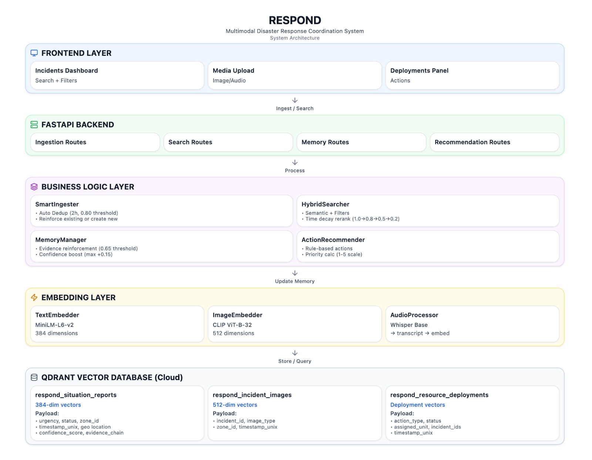

# RESPOND: (Final Report)

**Multimodal Disaster Response Coordination System using Qdrant as Evolving Situational Memory**  
**Convolve 4.0 Qdrant MAS Track Round 2 Submission**

## 1. Problem Statement

### Problem Context

During natural disasters—earthquakes, floods, fires, and building collapses—**seconds decide survival**. Yet the moment help is needed most is when information becomes chaotic.

Emergency response systems struggle with:
- **Information overload** from calls, social media, sensors, and satellites  
- **Duplicate reports** of the same incident, wasting responder time  
- **Verification delays** due to unreliable or unverified sources  
- **Lack of time awareness**, treating old and new incidents equally  
- **Disconnected data**, with text, images, and audio stored in silos  
- **Static records** that cannot evolve as new evidence arrives  

These limitations prevent systems from handling the **volume, velocity, veracity, and variety** of modern disaster data.

---

### Why This Matters

- Fire survival rates drop **50% every 5 minutes**  
- **75%** of earthquake rescues occur within the **first hour**  
- Flash floods may allow only **6 minutes** to evacuate  

Traditional, pre-digital systems cannot meet these demands.

---

### Our Solution: RESPOND

RESPOND treats disaster response as an **evolving memory problem**, introducing three paradigm shifts:

1. **Incidents as Evolving Memories**  
   Incidents strengthen with corroborating evidence and fade over time.

2. **Automatic Multi-Source Verification**  
   Semantic similarity links independent reports, reducing duplicates and boosting confidence.

3. **Multimodal Evidence Fusion**  
   Text, images, and audio are embedded in a shared vector space, enabling automatic evidence linking.

---

### Outcome

RESPOND provides a **real-time, verified, and prioritized view** of incidents—transforming chaos into actionable intelligence for first responders.


## 2. System Design

## 2.1 Architecture Overview

**RESPOND** is built on a **vector-native architecture** with **Qdrant at its core**, enabling real-time understanding, deduplication, and decision-making during emergency situations.

### High-Level Flow

**Frontend → FastAPI Backend → Business Logic → Embeddings → Qdrant Cloud**

---

### Frontend Layer
Responders interact with RESPOND through three modules:
- **Incident Search** – discover active and related emergencies
- **Media View** – images, audio, and supporting evidence
- **Actions** – view and trigger recommended responses

---

### FastAPI Backend
Handles:
- Incident ingestion
- Semantic and filtered search
- Memory and evidence updates

---

### Business Logic Layer (Core Intelligence)

- **SmartIngester**
  - Detects duplicate incidents within a **2-hour window**
  - Uses semantic similarity (**threshold: 0.80**)
  - Reinforces existing incidents or creates new ones

- **HybridSearcher**
  - Combines **vector search + metadata filters**
  - Applies **time decay** to prioritize recent incidents
  - Extracts confirmation signals from evidence

- **MemoryManager**
  - Reinforces incident confidence (**threshold: 0.65**)
  - Updates payloads **without re-embedding vectors**
  - Enables real-time confidence evolution

- **ActionRecommender**
  - Rule-based action suggestions
  - Priority scoring (**1–5 scale**)
  - Aggregates actions across related incidents

---

### Embedding Layer (Multimodal)

- **Text** → MiniLM-L6 (**384 dimensions**)
- **Images** → CLIP ViT (**512 dimensions**)
- **Audio** → Whisper (speech-to-text)

---

### Qdrant Vector Database (Cloud)

Separate collections for each modality:
- **situation_reports**
  - Incident text embeddings
  - Metadata: urgency, zone, status, timestamp
  - Payload: confidence score, evidence chain

- **incident_images**
  - Image embeddings linked to incidents
  - Payload: image path, zone

- **resource_deployments**
  - Action and deployment tracking

Each incident exists as a **vector + evolving payload**, making Qdrant RESPOND’s long-term memory.

---

## 2.2 Why Qdrant Is Critical to RESPOND

Qdrant is not just storage—it enables RESPOND to function in real time.

### 1. Real-Time Deduplication at Scale
- Every incident is stored as a vector
- New reports are matched in milliseconds using **HNSW search**
- Handles **thousands of reports per minute** during disasters

---

### 2. Semantic Search with Operational Filters
Responders can query:
- “Fires in zone-3 from last 6 hours”
- “Critical incidents still pending response”

Qdrant performs **vector similarity and filtering in a single query**, returning only relevant results.

---

### 3. Evolving Memory Without Re-Embedding
- Vectors remain unchanged
- Only payload fields (confidence, evidence) are updated
- Enables fast updates and stable search behavior

Incidents behave like **living memories**, not static records.

---

### 4. True Multimodal Support
RESPOND supports:
- Text reports
- Images and visual evidence
- Response actions

Qdrant allows **different vector dimensions per collection**, preserving semantic accuracy.

---

### 5. Cloud Reliability for Emergency Systems
RESPOND uses Qdrant Cloud for:
- **99.9% uptime SLA**
- Automatic backups
- Global low-latency access
- Instant scalability during disasters

---

## 2.3 Data Flow Example (Simplified)

**Scenario: One building fire reported by multiple sources**

1. Social media post creates a new incident (confidence: 0.5)
2. Emergency call matches the incident → confidence increases
3. Image upload adds visual evidence
4. Sensor alert confirms heat signature
5. Responder search returns a **multi-source verified incident**

**Key Insight:**  
The incident is embedded **once**.  
All future updates modify only the payload—demonstrating Qdrant’s **evolving memory** model.

---

### Final Takeaway

RESPOND works because **Qdrant treats incidents as intelligent, evolving memories**—not static database entries.

This enables fast, reliable, real-time emergency response.

### System Architecture Diagram

The overall system architecture of RESPOND is illustrated in **Figure 1**.  
The diagram shows the end-to-end flow from incident ingestion to search, memory evolution, and action recommendation, with **Qdrant Cloud acting as the central evolving memory layer**.



**Figure 1:** RESPOND system architecture highlighting the frontend, FastAPI backend, embedding layer, Qdrant-based vector memory, and rule-based action recommendation pipeline.


## 3. Multimodal Strategy

RESPOND is designed to understand emergencies the way humans report them — through **text, images, and audio**. Each modality strengthens the system’s situational awareness without creating duplicate incidents.

---

## 3.1 Data Types Used

RESPOND processes three primary modalities:

| Modality | Examples | Purpose |
|--------|--------|--------|
| **Text** | Social media posts, emergency call transcripts, sensor alerts, official reports | Core incident description, semantic search, deduplication |
| **Images** | Photos, satellite images, drone footage, CCTV snapshots | Visual verification, damage assessment, text-to-image discovery |
| **Audio** | Emergency calls, radio communication, field recordings | Transcription → text reinforcement (voice analysis planned) |

Text acts as the **primary signal**, while images and audio act as **evidence boosters**.

---

## 3.2 Embedding Creation

### Text Embeddings
- **Model:** `all-MiniLM-L6-v2`
- **Dimensions:** 384  
- **Why this model:**
  - Trained on large-scale semantic similarity data
  - Fast enough for real-time response (CPU-friendly)
  - Excellent for short emergency reports (10–200 words)

**Behavior:**
- Embeddings are normalized
- Typical similarity: `0.3 – 0.7`
- Deduplication threshold: **0.80** (only near-identical incidents merge)

If the model is unavailable (offline/dev mode), RESPOND falls back to deterministic pseudo-embeddings.

---

### Image Embeddings
- **Model:** CLIP (`ViT-B-32`)
- **Dimensions:** 512  
- **Why CLIP:**
  - Text and images share the **same semantic space**
  - Excellent at disaster visuals (fires, floods, collapsed buildings)

**Key capability:**  
Responders can search images using **natural language**:
> “fire with heavy smoke” → returns visually similar fire images  
No manual tags required.

---

### Audio Processing
- **Model:** OpenAI Whisper (base)
- **Output:** Transcribed text → embedded using MiniLM (384-dim)

**Why Whisper:**
- Robust to noise, panic, accents
- Automatic language detection
- Reliable in emergency conditions

Audio never creates duplicate incidents — it **reinforces existing ones** with additional evidence.

---

## 3.3 Multimodal Querying

RESPOND supports seamless cross-modal search:

### Text → Text (Primary)
Responders search naturally:
> “building collapse trapped victims”

The system retrieves semantically similar incidents, even if wording differs:
- *collapse* ≈ *fell* ≈ *structural failure*
- *trapped* ≈ *stuck* ≈ *casualties*

---

### Text → Image (CLIP)
Responders describe what they want to **see**:
> “flooded street with submerged vehicles”

RESPOND returns matching images — even if those images have no text metadata.

---

### Audio → Text Reinforcement
Emergency calls are:
1. Transcribed
2. Embedded
3. Matched against existing incidents

If similarity ≥ **0.80**, the call **strengthens** the incident instead of duplicating it.

---

## 3.4 Storage Strategy

RESPOND uses **separate Qdrant collections per modality**:

### `situation_reports` (Text)
- 384-dim vectors
- Payload includes:
  - Incident text, location, zone, urgency, status
  - Confidence score
  - Evidence chain (calls, sensors, reports)

### `incident_images` (Images)
- 512-dim CLIP vectors
- Linked to incidents via `incident_id`
- Stores visual evidence only

**Why separate collections?**
1. Different vector dimensions (384 vs 512)
2. Different access patterns (search vs verification)
3. Independent scaling (millions of incidents, fewer images)

---

### Key Takeaway

RESPOND treats **text as the anchor**, and **images + audio as reinforcing evidence**.  
All modalities strengthen the same incident memory — creating a clear, verified, and actionable view for responders.

## 4. Search, Memory & Recommendation Logic

RESPOND is designed to **find the right incident fast**, **remember it accurately**, and **recommend the right action with clear justification**.

---

## 4.1 How Search Works

RESPOND uses a **4-stage retrieval pipeline** to ensure results are both **relevant and timely**:

**Query → Vector Search → Time Awareness → Final Ranking**

---

### Stage 1: Query Understanding
- User enters a natural-language query (e.g., *“fire emergency zone-3”*)
- Optional filters: zone, urgency, status, time range
- Query is converted into a **semantic vector**
- Filters are applied **inside Qdrant**, not after search

**Why this matters:**  
Filtered searches are just as fast as unfiltered ones — critical for real-time response.

---

### Stage 2: Vector Search (Qdrant)
- Uses **HNSW** for fast similarity search
- Sub-second latency even with millions of incidents
- Returns the most semantically similar incidents

---

### Stage 3: Time Awareness & Evidence Extraction
Search results are adjusted using **time decay**:

| Incident Age | Weight |
|-------------|--------|
| ≤ 1 hour | 1.0 |
| ≤ 6 hours | 0.8 |
| ≤ 24 hours | 0.5 |
| > 24 hours | 0.2 |

This prevents old incidents from outranking fresh emergencies.

At the same time, RESPOND extracts:
- Confidence score
- Evidence count
- Multi-source verification status

---

### Stage 4: Final Reranking
Results are reranked by:
final_score = semantic_similarity × time_decay


**Outcome:**  
Responders see **recent + relevant incidents**, not just textually similar ones.

---

## 4.2 Memory: How Incidents Evolve

RESPOND treats incidents as **living memories**, not static records.

---

### 4.2.1 Initial Storage (Ingestion)
- New reports are checked against recent incidents (last **2 hours**)
- If similarity ≥ **0.80**, the report is **deduplicated**
- Otherwise, a new incident is created

**Defaults:**
- Initial confidence: **0.50**
- Deduplication threshold: **very strict** (true duplicates only)

---

### 4.2.2 Memory Reinforcement (Core Innovation)

When new evidence arrives (call, sensor, image):

- Similarity ≥ **0.65** → evidence accepted
- Confidence increases (max **+0.15 per evidence**)
- Evidence is appended to the incident’s history
- **Vector never changes — only metadata updates**

**Why this design works:**
- The original report defines the incident’s identity
- Confidence and verification are **context**, not semantics
- Searches remain stable, while trust increases

**Example Confidence Evolution:**
t=0:00 → 50% (new incident)
t=0:03 → 58% (call)
t=0:05 → 65% (sensor)
t=0:08 → 72% (image)
✓ Multi-source confirmed


---

### 4.2.3 Memory Reuse in Search Results
Every search result includes:
- Current confidence level
- Evidence timeline
- Multi-source verification badge

**Frontend displays:**
- Confidence bar
- ✓ Verified indicator
- Evidence history (social → call → sensor → image)

This builds **operator trust** instantly.

---

## 4.3 Recommendation Logic

RESPOND doesn’t just find incidents — it suggests **what to do next**.

---

### 4.3.1 Action Generation
Actions are derived from:
- Incident text
- Urgency level
- Verification status

**Example keyword → action mapping:**
- *fire* → Dispatch Fire Brigade
- *trapped* → Search & Rescue
- *flood* → Evacuation Alert
- *collapse* → Heavy Equipment

**Priority calculation (1–5):**
- Base priority from rule
- +1 if incident is **critical**
- +1 if **multi-source confirmed**
- Capped at 5

Duplicate actions across incidents are **merged and prioritized**.

---

### 4.3.2 Evidence-Grounded Recommendations

Every recommendation is **traceable**:
- Linked to specific incident IDs
- Backed by original reports
- Automatically downgraded if incidents are resolved

**Why this matters:**
- Responders can see *why* an action was suggested
- Full audit trail for accountability
- Builds trust in automated decision support

---

## Key Takeaway

RESPOND combines:
- **Fast semantic search**
- **Evolving incident memory**
- **Evidence-based recommendations**

The result is a system responders can **understand, trust, and act on — immediately**.

## 5. Limitations, Bias, Privacy & Ethics

### 5.1 Known Failure Modes

#### 5.1.2 Embedding Drift
**Issue:** General-purpose embeddings may misunderstand disaster-specific language.  
**Impact:** Non-emergency events can surface as critical incidents.

**Mitigation:**
- Urgency and status-based filtering  
- **Planned:** Fine-tuning embeddings on:
  - FEMA incident reports  
  - Red Cross emergency logs  
  - Disaster-related social media data  

---

#### 5.1.3 CLIP Image Misidentification
**Issue:** Non-disaster images (e.g., BBQ smoke) detected as emergencies.  
**Impact:** False positives in image-based search.

**Mitigation:**
- Image-type filtering  
- Incident-linked urgency inheritance  
- **Planned:** Disaster-specific CLIP fine-tuning  
- **Planned:** Second-stage disaster vs. non-disaster classifier  

---

#### 5.1.4 Over-Aggressive Time Decay
**Issue:** Long-running disasters lose visibility over time.  
**Impact:** Active crises are buried under newer, less important events.

**Mitigation (Planned):**  
Status-aware decay logic:
```python
if status != "resolved":
    decay = max(decay, 0.5)
```

### 5.1.5 Whisper Transcription Errors
**Issue:** Background noise, panic, and accents can cause transcription and location errors.  
**Impact:** Incorrect deduplication and misrouted responses.

**Mitigation:**
- Lenient similarity threshold to tolerate minor variations  
- Human review for critical incidents  
- **Planned:** Confidence scoring for transcripts  
- **Planned:** Raw audio playback for operator verification  

---

### 5.1.6 Single Point of Failure (Qdrant)
**Issue:** A Qdrant outage can stall ingestion and search operations.

**Mitigation:**
- 99.9% uptime SLA and continuous health checks  
- **Planned:** Local read-only Qdrant mirror  
- **Planned:** Offline incident queuing with delayed synchronization  

---

## 5.2 Bias Considerations

### 5.2.1 Geospatial Bias
**Risk:** Urban areas dominate training data.  
**Mitigation:**
- Regular rural ranking audits  
- **Planned:** Zone-weighted scoring to balance representation  

### 5.2.2 Language Bias
**Risk:** English-centric embeddings underperform for other languages.  
**Mitigation:**
- Multilingual Whisper transcription  
- **Planned:** Multilingual embedding models  
- **Planned:** Language-aware search logic  

### 5.2.3 Source Bias
**Risk:** Viral social media reports overpower official sources.  
**Mitigation:**
- Source diversity tracking  
- **Planned:** Reliability-weighted scoring:
  - Sensors: **1.5×**  
  - Official reports: **1.3×**  
  - Emergency calls: **1.2×**  
  - Social media: **1.0×**  

---

## 5.3 Privacy Considerations

### 5.3.1 Text PII
**Risk:** Names, phone numbers, and addresses may be stored and exposed.

**Mitigation:**
- Explicit user consent  
- **Planned:** Automatic PII redaction using NER  
- **Planned:** 90-day retention for resolved incidents  

### 5.3.2 Image Privacy
**Risk:** Disaster images may reveal identifiable faces.

**Mitigation:**
- Restricted image access  
- **Planned:** Automatic face blurring  

### 5.3.3 Audio Privacy
**Risk:** Emergency calls contain voice biometrics and personal data.

**Mitigation:**
- Secure storage with limited access  
- Only transcripts indexed  
- **Planned:** Voice anonymization  
- **Planned:** Automatic deletion after 30 days  

---

## 5.4 Safety Considerations

### 5.4.1 Malicious Reports
**Risk:** Fake incidents waste responder resources.

**Mitigation:**
- Source tracking  
- **Planned:** Reputation scoring per source  
- **Planned:** Anomaly detection  
- **Planned:** Rate limiting  

### 5.4.2 Adversarial Text
**Risk:** Crafted text triggers false emergencies.

**Mitigation:**
- High similarity threshold  
- **Planned:** Keyword-based sanity checks  

### 5.4.3 Reinforcement Abuse
**Risk:** Artificial confidence boosting via fake multi-source reports.

**Mitigation:**
- Similarity gating  
- **Planned:** Mandatory source diversity  
- **Planned:** Human review for critical incidents  

---

## 5.5 Ethical Principles
- **Transparency:** Full evidence chain visibility  
- **Human-in-the-loop:** Humans make final decisions  
- **Auditability:** Complete logs and confidence scores  
- **Fairness:** Regular bias audits  
- **Privacy-first:** PII redaction and retention limits  
- **Responsible AI:** No autonomous life-critical decisions  

---

## Conclusion

RESPOND transforms disaster response from **chaotic reaction** into **coordinated intelligence**.  
By treating incidents as evolving memories in Qdrant’s vector space, it enables:

- Smart deduplication  
- Multi-source verification  
- Real-time, time-aware prioritization  
- Unified text, image, and audio search  

### Why Qdrant Matters
Without Qdrant:
- Deduplication would not scale  
- Confidence updates would be slow  
- Real-time multimodal ranking would be impractical  

### Future Work
- LLM-based action explanations  
- Disaster-specific embedding models  
- Advanced malicious-behavior detection  
- Full multilingual support  

**Impact:** Faster verification, fewer duplicates, quicker response —  
**saving lives when every second matters.**


**Repository**: [https://github.com/bytebender77/RESPOND](https://github.com/bytebender77/RESPOND)  
**Team**: Palak Soni, Kunal Kumar Gupta
